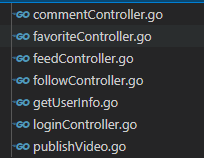
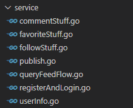
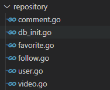

# 极简抖音项目

## 项目简介
本项目为极简版抖音的后端项目，已实现基础接口、扩展接口Ⅰ和扩展接口Ⅱ  
web框架：gin  
数据库：MySQL  
中间件：Redis
#### 演示视频：
[演示视频地址](img/tiktokdemo.mp4)  

## 项目架构
本项目使用经典的**MVC三层架构**  
其中：  
controller层负责响应接口      
   
service层负责处理业务逻辑  
      
repository层负责数据库交互    
 

